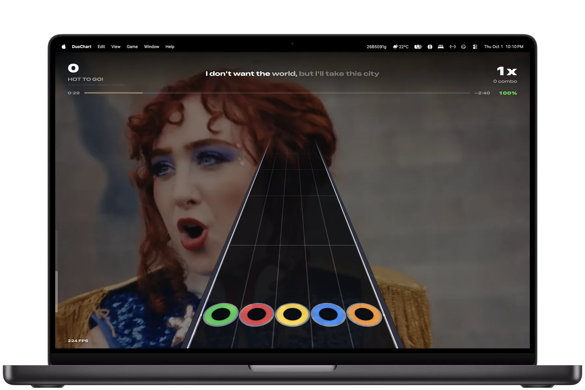
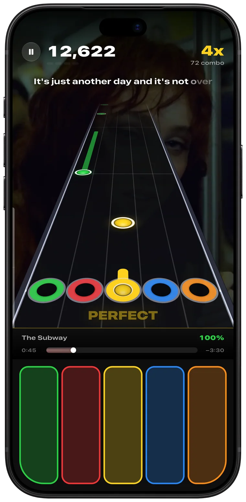
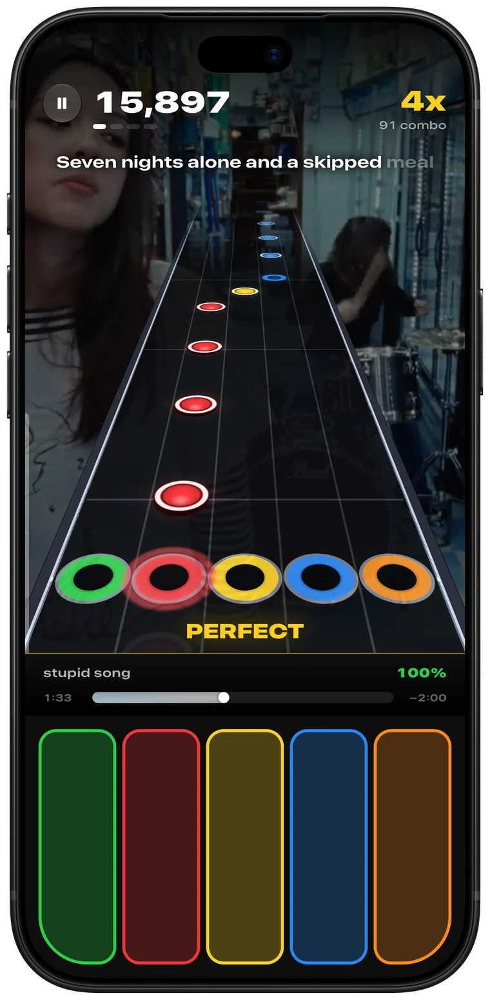
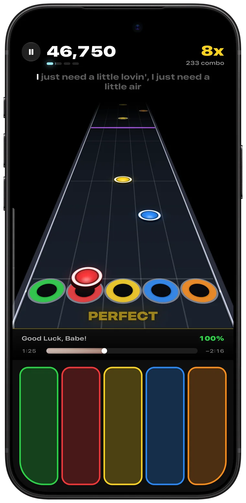
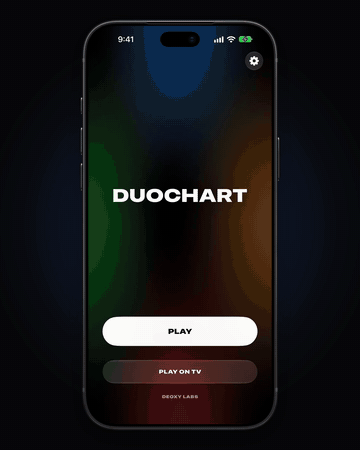
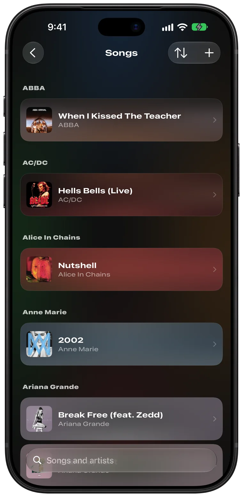
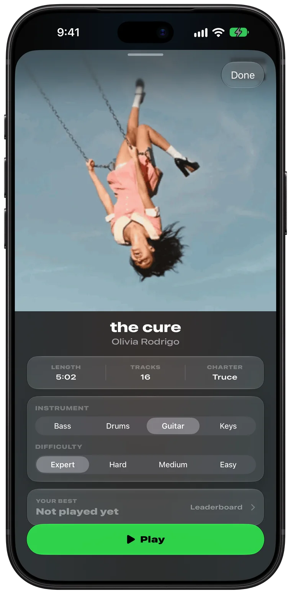
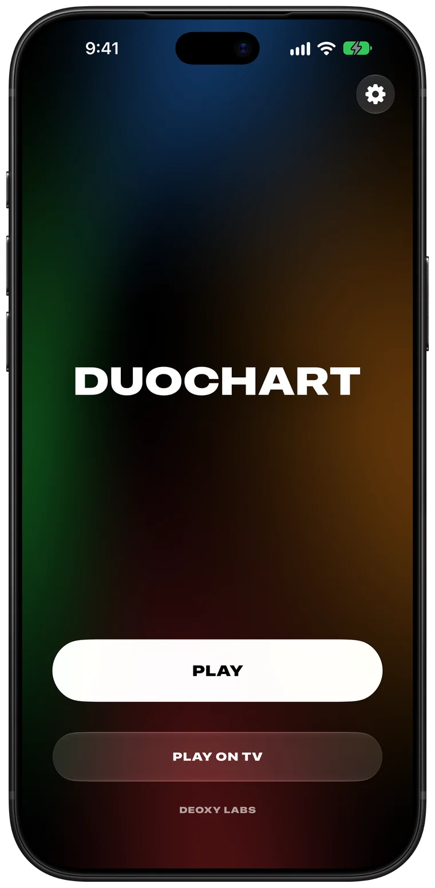
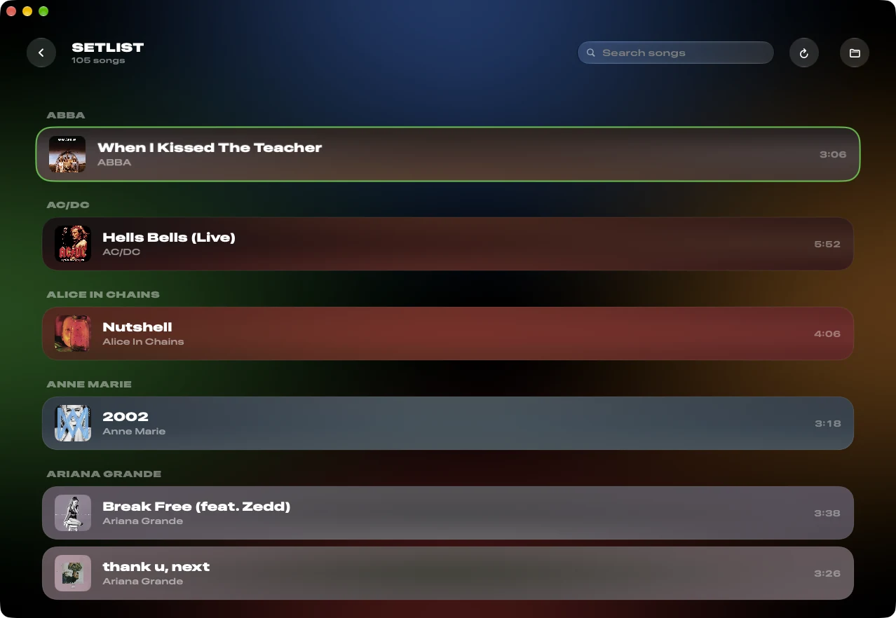

  

<h1 align="center">DuoChart</h1>

  <strong>Play the songs you love, note for note.</strong> 
  A rhythm game for iPhone and Mac, by <a href="https://deoxylabs.com">Deoxy Labs</a>.

  <a href="https://github.com/deoxylabs/duochart/releases/latest/download/DuoChart-iPhone.ipa"><strong>Download for iPhone</strong></a>
  &nbsp;&nbsp;&nbsp;
  <a href="https://github.com/deoxylabs/duochart/releases/latest/download/DuoChart-Mac.zip"><strong>Download for Mac</strong></a>

  

---

## This is my game.

DuoChart is a rhythm game I made because I wanted one that felt at home on Apple devices. Notes race down a five-lane highway in time with the music, and you hit each one as it reaches the frets. When a song has a music video, it plays behind the highway. When it has lyrics, they light up as you go.

It's free. Download it if you'd like.

  
  &nbsp;
  
  &nbsp;
  

## Bring your own songs.

DuoChart plays standard rhythm game song folders: a `.chart` or `.mid` file with the song's audio, and optionally its album art and video. If you already have a song library from another game, it works as it is. No songs are included.

**On iPhone,** open Songs, tap **Import**, and choose one or more song folders in Files. You can also drop folders into **On My iPhone › DuoChart › Songs**.

**On Mac,** point DuoChart at your songs folder in Settings.

  

  
  &nbsp;
  
  &nbsp;
  

## Install it.

DuoChart isn't on the App Store, so you sign it yourself. It's quick.

### iPhone

1. Download **DuoChart-iPhone.ipa** from the [latest release](https://github.com/deoxylabs/duochart/releases/latest).
2. Install it with a sideloading app such as [AltStore](https://altstore.io), [SideStore](https://sidestore.io) or [Sideloadly](https://sideloadly.io), signed with your own Apple Account.
3. If iOS asks, turn on **Developer Mode** in Settings › Privacy & Security, and trust your Apple Account in Settings › General › VPN & Device Management.

With a free Apple Account, apps you sign yourself expire after seven days. Refresh it in your sideloading app to keep playing; your songs and scores stay put.

### Mac

1. Download **DuoChart-Mac.zip** from the [latest release](https://github.com/deoxylabs/duochart/releases/latest) and open it.
2. Move **DuoChart** to your Applications folder.
3. The first time, Control-click DuoChart and choose **Open**, then **Open** again. If macOS still won't open it, go to System Settings › Privacy & Security and choose **Open Anyway**.

  
  &nbsp;
  

## Good to know.

| | |
| --- | --- |
| **Requires** | iOS 26 or later on iPhone. macOS 26 or later on Mac. |
| **Controls** | The fretboard on your iPhone's screen, or D F J K L on your Mac's keyboard (you can change the keys). |
| **Calibration** | On iPhone, calibrate once in Settings and every song is timed to your setup. |
| **Chart editor** | On Mac, write a chart for any song by playing along, slowed down. |
| **Scores** | Your best on every song is kept on your device. You can see the leaderboards, but copies you sign yourself don't post to them: there's no way to tell their scores from made-up ones. |
| **Game Center** | Not available in copies you sign yourself. |
| **Source code** | Not published. |

## About

DuoChart is made by [Deoxy Labs](https://deoxylabs.com), an independent software company in New South Wales, Australia and Texas, USA. Questions or problems? Open an [issue](https://github.com/deoxylabs/duochart/issues).

Song charts, audio and videos belong to their owners. DuoChart doesn't include or distribute any music.
